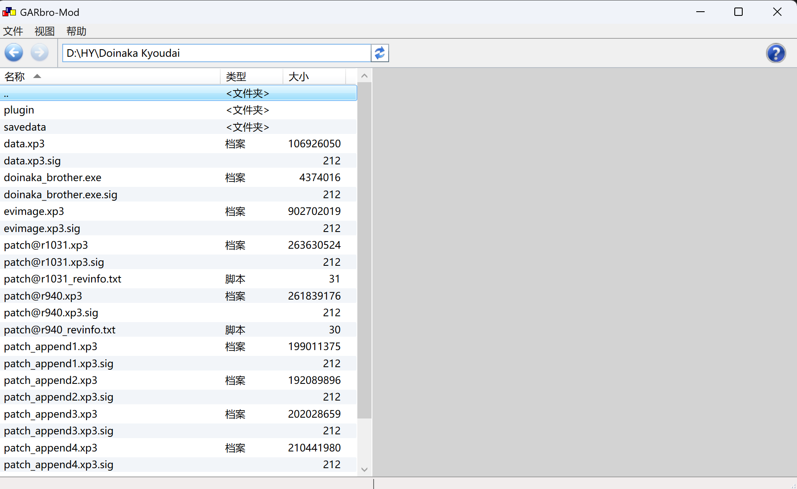

资源存储格式：`.xp3`

## 游戏信息

音频文件格式：`.ogg`、`.wav` 或 `.opus`

CG 文件格式：`.tlg` 或 `.pimg`

|           常见文件名            |    包含内容     |
| :-----------------------------: | :-------------: |
|         **`data.xp3`**          | **游戏主数据**  |
| **`event.xp3` / `evimage.xp3`** |   **事件 CG**    |
|        **`fgimage.xp3`**        |  **人物立绘**   |
|        **`bgimage.xp3`**        |  **背景图片**   |
|       **`scenario.xp3`**        |  **游戏脚本**   |
|  **`voice.xp3` / `sound.xp3`**  | **语音 / 音效** |
|          **`bgm.xp3`**          |  **背景音乐**   |
|        **`system.xp3`**         |  **系统界面**   |
|         **`patch.xp3`**         |  **游戏补丁**   |
|         **`adult.xp3`**         |   **R18 内容**   |

## 静态提取

使用 **[GARbro](https://github.com/nanami5270/GARbro-Mod)** 进行静态提取，适用于绝大多数未加密的 `.xp3` 文件，记得检查电脑的 `.NET` 版本

步骤如下：

1. 运行 GARbro.GUI.exe

2. 在 GARbro 左侧的文件树上方，粘贴游戏的根目录并回车

   

3. 寻找体积较大的 `.xp3` 文件，右键选择 **提取（Extract）**，设置输出路径就行

## 动态提取

若 GARbro 提示“无法识别的格式”、“密码错误”或提取出的音频无法播放，说明封包被加密

### krkr

使用 [KrkrExtract](https://github.com/xmoezzz/KrkrExtract) 进行动态提取

前提是游戏要能运行，如果只能用模拟器启动那还是用 GARbro 来提取；steam 中的 galgame 启动时需要先启动 steam，而 steam 会阻止其它应用注入内存，所以 krkrExtract 无法使用，此时更推荐 [steamless](https://github.com/atom0s/Steamless) ~~（虽然咱一般都是先游玩过再在 Steam 补票……）~~

步骤如下：

1. 将下载得到的文件（通常包括 KrkrExtract.Core.dll 、KrkrExtract. UI.Lite.dll 和 KrkrExtract.Lite.exe ）复制并粘贴到游戏的根目录下（与游戏主程序 .exe 在同一个文件夹中）

   

2. 将游戏的主程序拖拽到 KrkrExtract.exe 启动游戏，此时工具会自动注入游戏进程，并弹出一个 KrkrExtract 控制台

   

3. 把根目录下的 `.xp3` 文件直接拖入 KrkrExtract 控制台，工具会利用游戏自身的解密机制将文件解开，并输出到游戏目录下的 KrkrExtract_Output 文件夹

   

    

### krkrz

若 KrkrExtract 的控制台输出了红色的警告信息：`Unknown chunk in root chunk : 34767848, at address : 00000000`，即表明封包头被修改，此时使用 [KrkrZExtract](https://github.com/xmoezzz/KrkrzExtract)，使用方法同上

### 其他好用的工具

[KrkrDump](https://github.com/crskycode/KrkrDump)、[krkrzCxdec](https://github.com/YeLikesss/KrkrExtractForCxdecV2)，都适用较新的 `.xp3` 文件

### 杀手锏

如果实在没有办法，而游戏发售日期在 2010 年以后，建议搜一下游戏的相关信息，常用的搜索方式有：[维基百科](https://zh.m.wikipedia.org/)、[2dfan](https://galge.fun/)、[萌娘百科](https://mzh.moegirl.org.cn/Mainpage)，主要是查到游戏的发售日期、日文名、罗马音和游戏厂商

推荐一个大佬的博客：[乜都讲 D](https://blog.ztjal.info/)，名称是日文名，这时候就需要用搜到的日文名搜索

解释一下，他的格式是：
/[发售时间/]/[公司/] 名称
工具 1：工具内的插件，工具 2

> [210730][はむはむソフト] Lowな 妹 にサキュバスが 取 り 憑 いたので● 付 け 余裕 でした。
> crass：RealLive
>
> [210730][ういんどみるOasis] 悠久 のカンパネラ
> 7z，IrsysPack_CipherKey
>
> [210730][BISHOP] しりこん☆まじっく ～生 まれる 前 からあなた 専用？！～いんもらるえでぃしょん
> asmodean：exbsa

知道了工具就去百度或者谷歌上搜，网上应该有对应的使用方法

如果是最近刚刚出的游戏，根据游戏厂商信息去搜一下这个会社上一个游戏，对上一个游戏重复一遍解包流程，找出解包工具之后，再把新游戏用这个工具试一试

最后的最后，建议等大佬发解包好的资源，或者去贴吧碰碰运气

## 语音文件合并

选择 **[FFmpeg 命令行](https://ffmpeg.org/)** 进行无损拼接

步骤如下：

1. 下载 Windows 版本的压缩包，解压后，找到 bin 文件夹
2. 新建一个文件夹，把需要合并的散碎 `.ogg` 文件和 bin 中的文件复制进去
3. 在这个文件夹内，点击顶部的文件资源管理器地址栏，输入 `cmd` 并按下回车，在窗口中运行 `(for %i in (*.ogg) do @echo file '%i') > mylist.txt`
4. 运行合并命令 `ffmpeg -f concat -safe 0 -i mylist.txt -c copy output.ogg`，文件夹中会出现一个 `output.ogg`，这就是完整合并后的语音文件

如果出现 `Invalid argument` 错误终止，打开 `mylist.txt`，检查一下里面的日文/中文文件名目前是否能正常显示，点击记事本左上角的 **文件/另存为...**，找到 **编码(E)** 下拉菜单，将其从默认选项更改为 **UTF-8**，然后重新进行合并就行

## CG 格式转换

### .tlg 格式

使用 [tlg2png](https://github.com/vn-tools/tlg2png) 转换

下载完 tlg2png，在文件夹里打开 cmd 终端，输入以下命令：

`for %i in ("D:\game\cg\*.tlg") do tlg2png "%i" "D:\cgout\%~ni.png"`

> D:\game\cg 和 D:\cgout 分别替换自己设定的输入和输出地址

### .pimg 格式

`.pimg` 不像 `.tlg` 那样能一键转换，需使用 [FreeMote](https://github.com/UlyssesWu/FreeMote) 先解包，再用 [krkrFgiEditor](https://github.com/CjangCjengh/krkrFgiEditor) 拼接

1. 下载完 FreeMote，在文件夹里打开 cmd 终端，输入以下命令：

   `for /r "D:\Game\cg" %f in (*.pimg *.psb) do PsbDecompile.exe "%f"`

   > D:\Game\cg 替换自己提取的 cg 文件的地址

   运行后，每个 `.pimg` 会被解包成一个包含 `.png` 和 `.json` 的文件夹

2. 下载完 krkrFgiEditor，点击 **新建** 来创建不同的图层组，在右侧为每个图层组添加对应的图层文件，设置合成规则：

   > 例如，有“身体组”（含图 1、2）和“表情组”（含图 3、4），合成结果会自动生成 `1+3`、`1+4`、`2+3`、`2+4` 所有组合。

5. 选择保存路径，点击 **开始合成** 即可