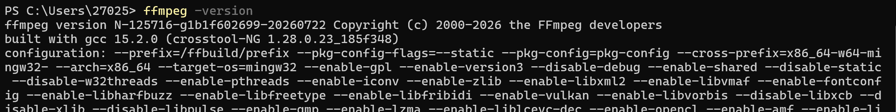
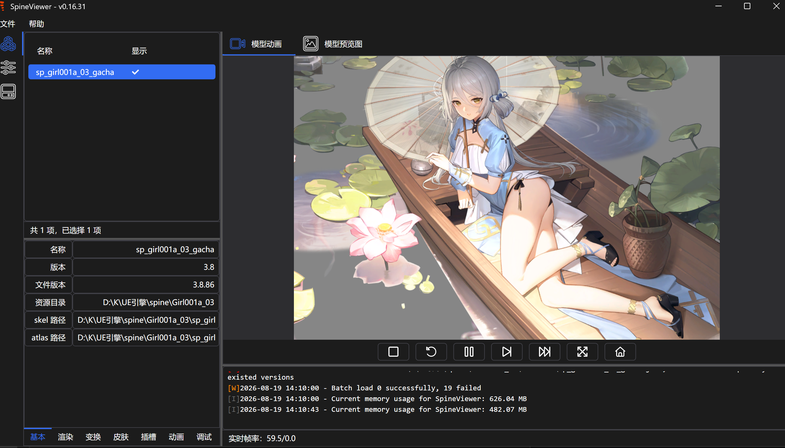
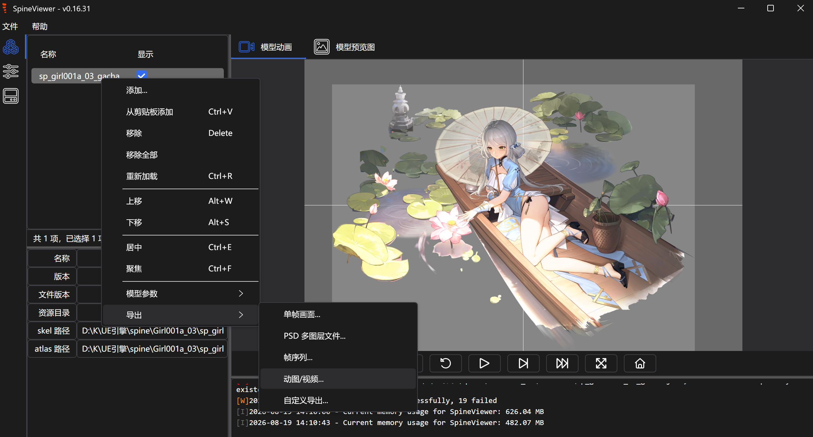

之前把尘白禁区的立绘文件提取在 spine 文件夹里面，现在来介绍如何把立绘拼接起来 ~~（当色色壁纸）~~

步骤如下：

1. 先下载专用工具 [SpineViewer](https://github.com/ww-rm/SpineViewer)（其实 live2dviewer 也能用，但我没有买它的 DLC 包所以用不了），下载 SelfContained 那个压缩包，以下过程如遇到问题请看 [软件参考文档](https://github.com/ww-rm/SpineViewer/wiki)

2. 打开 SpineViewer.exe，如果有导出 `.GIF`/`.MP4` 的要求的话，之前用到过的 FFmpeg 就派上用场了（参考 krkr 那篇），如果没有下载 FFmpeg，打开 SpineViewer 左上角的帮助选择 **下载 FFmpeg**，下载 Windows 版本的压缩包，解压后，找到 bin 文件夹并把它（如 D:\ffmpeg\bin）添加至系统环境变量 **PATH** 中

   > 添加方法：以 **管理员身份** 运行终端，然后执行 `setx /M PATH "%PATH%;D:\ffmpeg\bin"`
   >
   > D:\ffmpeg\bin 替换你下载的 FFmpeg 的 bin 文件夹地址
   >
   > 完成后再终端执行 ffmpeg -version，出现如图输出代表成功

   

3. 程序大致是左右布局：左侧是功能面板，右侧是预览画面，左侧有三个子面板：

   | 面板 | 功能                                                 |
   | :--- | :--------------------------------------------------- |
   | 模型 | 记录已导入的模型列表，设置渲染参数和顺序             |
   | 浏览 | 预览指定文件夹内容，可生成 webp 预览图或导入选中模型 |
   | 画面 | 设置右侧预览画面的参数（背景、缩放等）               |

   > **提示**：绝大部分按钮、标签或输入框都可以通过 **鼠标指针悬停** 来获取帮助文本

   导入骨骼文件有三种方法：

   - 将 `.skel`/`.json` 文件或整个文件夹拖放到左侧的模型面板中
   - 粘贴骨骼文件/目录到模型面板
   - 在浏览面板内右键菜单导入选中项

   如拖动某一个含有 `.atlas` 、`.json` 、`.png` 的文件夹进去，效果大概是这样

   

4. 在左侧模型面板中，右键点击要导出的模型，在弹出的菜单中选择 **导出/动图**，选择输出文件夹，点击 **确认** 就行

   

5. 如果有批量导出要求，步骤如下：
   - 将所有需要导出的 `.skel` 或 `.json` 文件，一起拖拽到 SpineViewer 左侧的模型面板中
   - 全选所有模型，右键点击要导出的模型，在弹出的菜单中选择 **导出/动图**，选择输出文件夹，**取消勾选导出单个选项**，点击 **确认** 就行

6. 如果需要导出文件数量太多，可以试试 SpineViewerCLI：

   - 新建一个文本文档，复制以下代码进去：

     ```bat
     @echo off
     set "CLI_PATH=D:\K\UE引擎\SpineViewer\SpineViewerCLI.exe"
     set "INPUT_DIR=D:\K\UE引擎\spine\"
     set "OUTPUT_DIR=C:\Users\27025\Desktop\cbjq\"
     
     for %%f in ("%INPUT_DIR%*.skel") do (
         echo Exporting %%f...
         "%CLI_PATH%" export "%%f" -f Mp4 -o "%OUTPUT_DIR%%%~nf.mp4" -a "idle" --fps 60
     )
     echo All exports completed.
     pause
     ```

     > 上面代码里三个 set 的地址自行替换：
     >
     > 第一个是 SpineViewerCLI.exe 所在位置，一般和 SpineViewer.exe 同文件夹
     >
     > 第二个是需要导出的文件的位置，把之前拆分好的文件复制进去就行
     >
     > 第三个是输出文件的位置，**注意二三地址末尾要加 “\”**

     > `-a "idle"` 指定要导出哪个动画片段
     >
     > `idle`（待机）、`walk`（走路）、`run`（跑步）、`attack`（攻击）
     >
     > 一般就设置为 `idle`，导出前可以看看是否包含其他片段
     >
     > `--fps 60` 设置 30、60 都可以
   
   - 然后保存，将文本文档重命名为 spineviewer.bat，双击运行

想导入 live2dviewer 的话我其实还没怎么研究，参考一下 [官网文档](https://live2d.pavostudio.com/doc/zh-cn/pc/manual/#_6) 会好一点儿吧~