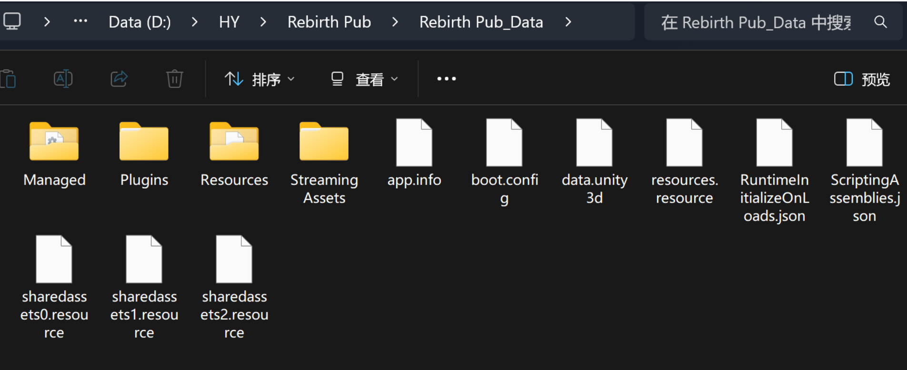
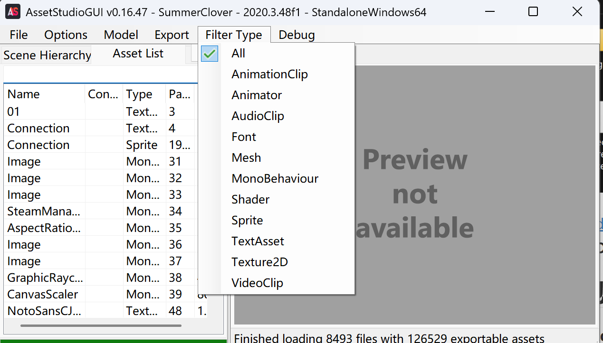
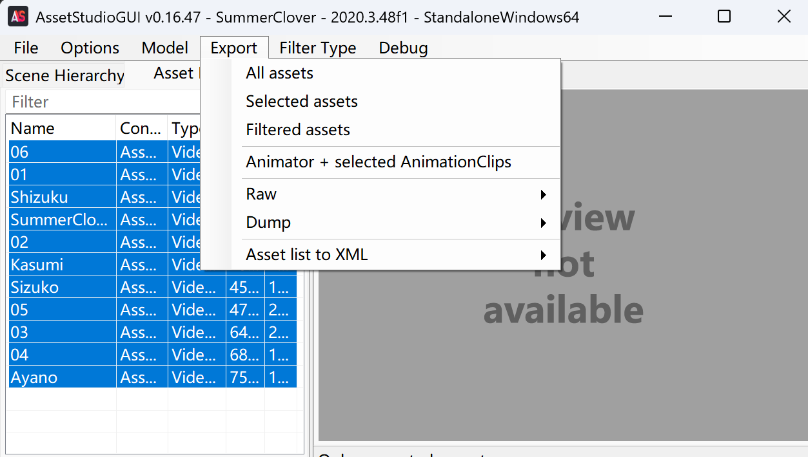

资源存储格式：`.bundle` ，其他包含格式有 `.assets`、`.resS`、`.resource` 等

解包步骤：

1. 在游戏根目录下，找到名为 **[游戏名称]_Data** 的文件夹，这个文件夹里包含了绝大部分的资源文件，如 Managed、Plugins、Resources 和最重要的 Streaming Assets，其中 Streaming Assets 里面的 aa 就存放着 `.bundle` 文件

   

2. 安装 [AssetStudio](https://github.com/Perfare/AssetStudio)，记得检查电脑的 `.NET` 版本

3. 打开 AssetStudioGUI.exe，左上角点击 **File/Load folder**，导入 **[游戏名称]_Data**  文件夹，可以勾选 **Enable Advanced Search** 来进行更深入的扫描

   > 如果导入时遇到无法解析 Shader 或报错为 `EndOfStreamException` 的问题，原因是 Unity 6000 版本更改了 Shader 的序列化格式，移除了部分旧字段，需要用更高版本的 [AssetStudioNext](https://github.com/Razviar/assetstudio) 来导入

4. 加载完成后，所有提取出的资源会按类型显示在左侧的 Asset List 中，可以通过顶部的筛选器 **Filter Type** 按资源类型来快速定位需要的文件，如果想选择连续的若干文件，先点击选中列表中的第一个文件，然后按住 Shift 键不放，再点击列表中的最后一个文件

   |  Type  |  类型  |
   | :-----------: | :--------: |
   | AnimationClip |  动画片段  |
   |   Animator    | 动画控制器 |
   |   AudioClip   |  音频片段  |
   |     Font      |    字体    |
   |     Mesh      |  网格模型  |
   | MonoBehaviour |  行为脚本  |
   |    Shader     |   着色器   |
   |    Sprite     |  精灵图片  |
   |   TextAsset   |  文本资源  |
   |   Texture2D   | 2D 纹理贴图 |
   |   VideoClip   |  视频片段  |

   

5. 筛选完之后，点击 **Export** 选择导出 **All assets（全部）** 、 **Selected assets（选中）** 或者 **Filtered assets（已筛选）**

   

   > 如果 AssetStudio 无法正常解析文件，说明游戏资源可能经过了加密
   >
   > 对于使用 IL2CPP 技术打包的游戏（常会有 il2cpp_data 文件夹），需要使用 [Il2CppDumper](https://github.com/perfare/il2cppdumper) 来从 GameAssembly.dll 和 global-metadata.dat 中还原代码结构，步骤如下：
   >
   > - 在 Il2CppDumper 文件夹内打开 cmd，命令为 `Il2CppDumper.exe "D:\Game\GameAssembly.dll" "D:\Game\global-metadata.dat" "D:\Output"`，GameAssembly.dll 地址通常在游戏根目录，global-metadata.dat 地址则是在 il2cpp_data 文件夹内
   > - 输出路径可能在 Il2CppDumper 文件夹内，我也不知道为啥设置了输出路径还能出错，结果一般有 DummyDll 文件夹（目标文件）、dump.cs、il2cpp.h、ida.py/ghidra.py
   > - 如果报错为 `ERROR: Metadata file supplied is not valid metadata file.`，说明 global-metadata.dat 被加密或混淆

补充：

[AssetRipper](https://github.com/assetripper/assetripper) 用于从 Unity 序列化文件（CAB-、`.assets`、`.sharedAssets` 等）和资源包（`.unity3d`、`.bundle` 等）中提取资源，并将其转换为原生 Unity 引擎格式，可以理解为 AssetStudio 功能更强的代替品

> 转换出的文件夹中：skeleton.atlas 为纹理图集，skeleton 为首的 png 文件为贴图，skeleton.skel.bytes 为骨骼文件

