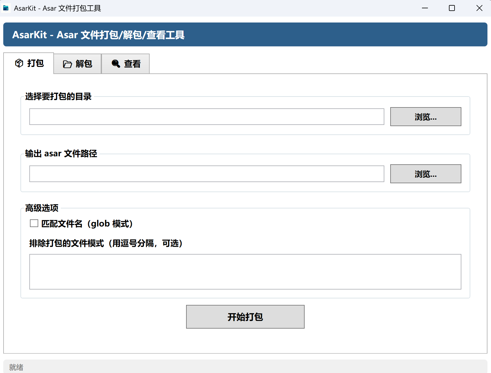
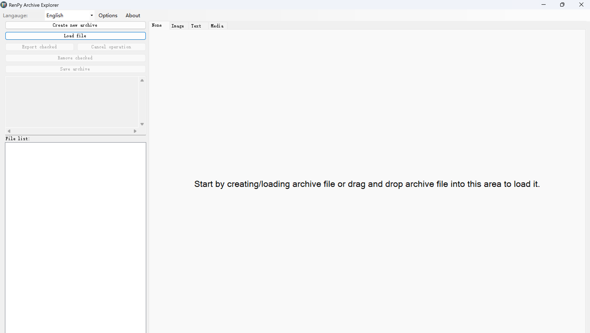

   > 持续更新中……

既然已经掌握了基本的 krkr 和 unity 的解包方法，那对于其他的解包方法也是一样的套路，一般的单机游戏都可以先用 GARbro 试试，实在不行再按文件类型尝试以下方法

## tyrano 引擎

资源存储格式：`.asar` 

使用 [AsarKit](https://www.52pojie.cn/thread-2120146-1-1.html) 进行解包，安装完成后打开 AsarKit.exe 进入以下界面，点击解包界面，选择文件路径和输出路径然后开始解包

AsarKit 相比于 [WinASAR](https://github.com/flydoos/WinASAR) 的优势是安装无依赖，如果 AsarKit 不行也可以试试 WinASAR

## renpy 引擎

资源存储格式：`.rpa` 

使用 [RPA-Explorer](https://github.com/UniverseDevel/RPA-Explorer) 进行解包，安装完成后打开 RPA Explorer.exe 进入以下界面

点击 **load file** 上传文件，然后解包就行

RPA-Explorer 还能创建和修改 `.rpa` 存档，甚至尝试反编译 `.rpyc` 脚本

如果 RPA-Explorer 不行也可以试试较新的 [rpaextract](https://github.com/Kaskadee/rpaextract) 