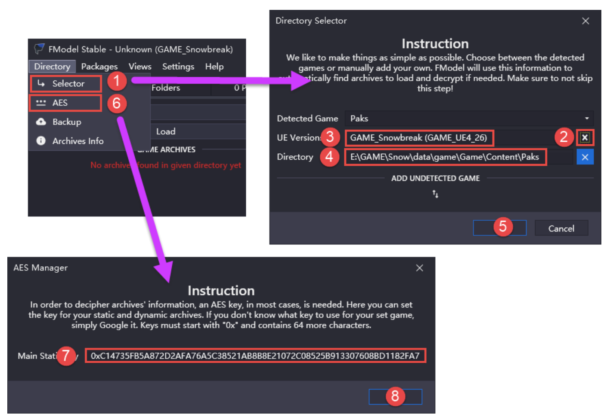
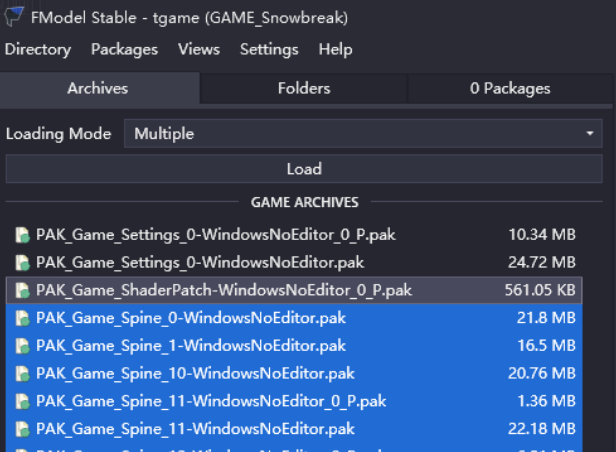
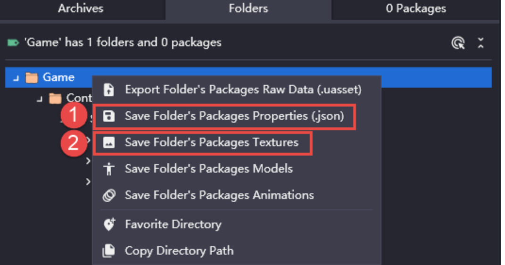
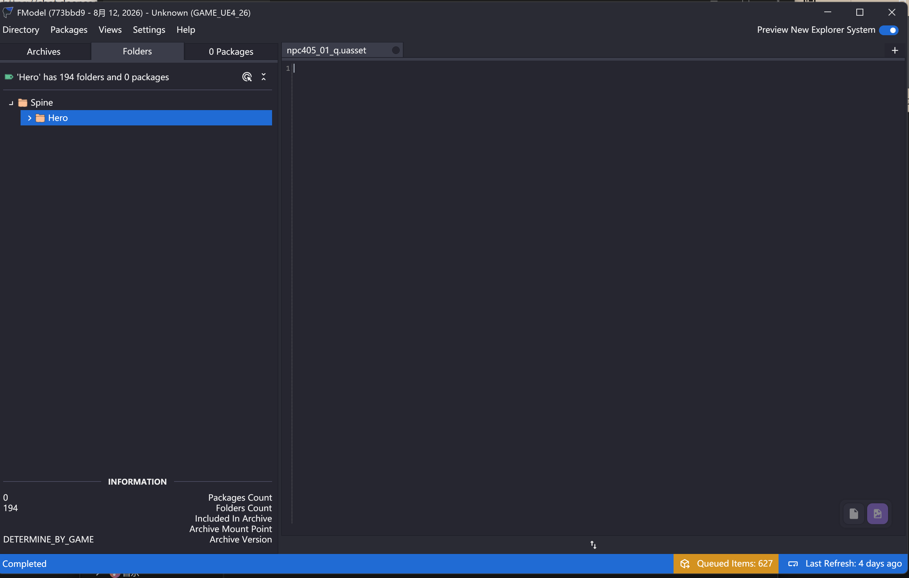
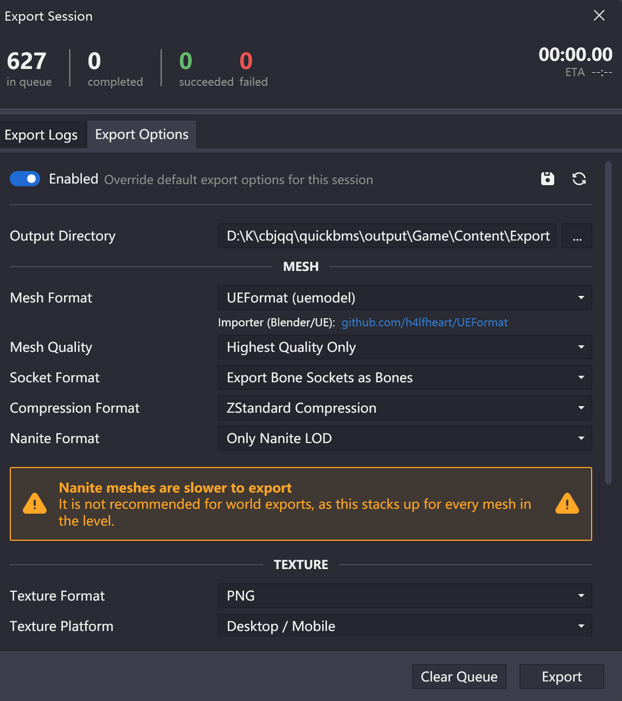
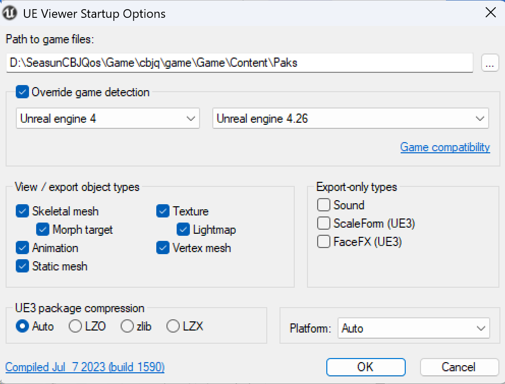

> 因为尘白禁区一直在无更新运营，所以突发奇想，把自己喜欢的东西保存下来

## 准备工作

### 游戏信息

引擎：**Unreal Engine 4.26.2**

资源存储格式：`.pak` 

PAK 文件路径：…\SeasunCBJQos\Game\cbjq\game\Game\Content\Paks

### 必备工具

**AES Key**：`0xC14735FB5A872D2AFA76A5C38521AB8B8E21072C08525B913307608BD1182FA7`

> 如果 Key 过时了，请在 [CSRINRU](https://cs.rin.ru/forum/viewtopic.php?f=10&t=100672) 获取最新 Key

提取 `.pak` 文件：[QuickBMS](https://github.com/LittleBigBug/QuickBMS) 和 [脚本](https://live2dhub.com/uploads/short-url/w3AAdbp8RsmeP1rbKfKrTtBjSAy.rar)

查看/提取 `.uasset` 文件：[UE Viewer（UModel）](https://www.gildor.org/en/projects/umodel#files) 或 [FModel](https://fmodel.app/)，记得检查电脑的 `.NET` 版本

## 解包过程

### 使用 FModel 提取

1. 打开 FModel.exe，点击左上角 **Directory**，然后选择 **Selector**，在 **ADD UNDETECTED GAME** 一栏选择要解包的路径，然后点击加号加入路径

2. 选择 **AES** 填入 Key，解密成功后由红色变为绿色（输入密钥后需要重启一下），然后全选点击 **load** 上传

   > 如果发现未变成绿色请先用第二种方法的 QuickBMS 提取文件，然后把导出文件的路径加入 FModel 进行再提取

   

> Archives 标签页：Paks 文件夹中所有可用的 `.pak` 文件
>
> Folders 标签页：`.pak` 的层次结构
>
> Packages 标签页：当前选定文件夹中的文件
>

   

3. 选择你需要的文件或文件夹（文件夹描述见 UModel 第二步），右键导出

   如果想导出立绘，选择以下两项：**Properties** 和 **Textures**，如果不能选择就分开导出

   

4. 等待 FModel 日志输出完毕，点击右下角黄色部分 **Queued Items**

   
5. 切换到 Export Options 界面，确保第一行按钮为 **Enabled**，点击 Mesh Format 选择 **UEFormat（uemodel）**

   

6. 如果还想拼接立绘的话，下载 [尘白禁区-拆分 atlas、skel、json(.NET Framework 4.6.2)](https://live2dhub.com/uploads/short-url/yMMdjTWqGGzDsFX9SRgvMnObb3c.zip)，解压过后把导出的文件夹拖到拆分图标上，就能得到 `.atlas` （可能有 `.skel` ）文件，搭配一开始用 FModel 导出的立绘 `.png` 文件，拼接立绘的教程以后会出，先鸽了~

### 使用 QuickBMS + UModel 提取

步骤如下：

1. 打开 unreal_tournament_4_0.4.27e_snowbreak.bms，搜索 `set AES_KEY binary ""` 这一行，将 AES key 填入 `" "` 之中

2. 在 cmd 中运行：`D:\quickbms_4gb_files.exe D:\unreal_tournament_4_0.4.27e_snowbreak.bms "D:\SeasunCBJQos\Game\cbjq\game\Game\Content\Paks" ./output`

   > 这是一整行代码，别分段；其中上面的三个地址按照自行替换
   >
   
   这个过程很长，耐心等待，最终结果如下：

|           文件夹名称            |                   储存内容                    |
| :-----------------------------: | :-------------------------------------------: |
|          `Blueprints`           |             蓝图类（交互、技能）              |
|          `Characters`           |    **角色 3D 模型、骨骼、身体贴图、动画**     |
|          `cinematics`           |                 角色过场动画                  |
|         `Environments`          |    游戏关卡地图（`.umap`）、地形、建筑模型    |
|            `Effects`            |             粒子特效、爆炸、光效              |
|             `Maps`              |   地形、光照、摆放的物体和角色出生点等信息    |
|           `Materials`           |               材质球和材质实例                |
|              `Mod`              |            游戏内的配件/改装件系统            |
|            `Movies`             |               **过场 CG 视频**                |
|            `Script`             |           游戏脚本代码（部分逻辑）            |
|             `Spine`             | **2D 动态立绘、看板娘动画（Spine 骨骼动画）** |
|            `Startup`            |            启动 LOGO、加载界面配置            |
|             `Plot`              |     **剧情对话、文本、本地化 JSON 文件**      |
|             `Props`             |       场景道具、武器、家具、静态网格体        |
|              `UI`               |            界面按钮、图标、背景图             |
|             `Wwise`             |  **游戏音效、角色语音、BGM（`.wem` 格式）**   |
|      `ShaderPatch`（可能）      |                  着色器补丁                   |
|     `PreloadConfig`（可能）     |    预加载配置（根据截图 `PreloadCo` 推断）    |
| `ShaderArchive-Game-PCD3D-ES31` |    预编译的 GPU 着色器缓存（PC 和移动端）     |

3. 打开 umodel_64.exe，指定引擎版本，文件夹目录选择刚才导出的目录

   

>   **注意事项**：
>
>   - 双击文件可以预览，但是预览结束不要直接右上角关闭，而是需要点击 O 重新呼出主面板，直接点击右上角会把整个程序关掉
>   - 一般来说，sm 结尾的都是 StaticMesh，skm 结尾的都是 SkeletalMesh，如果要快速从一堆文件中找到 Mesh，留心文件名就行
>   - 右键文件夹和右键文件都可以选择 **Export** 进行解包