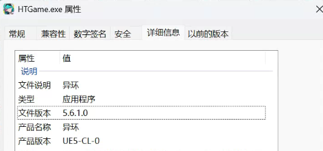
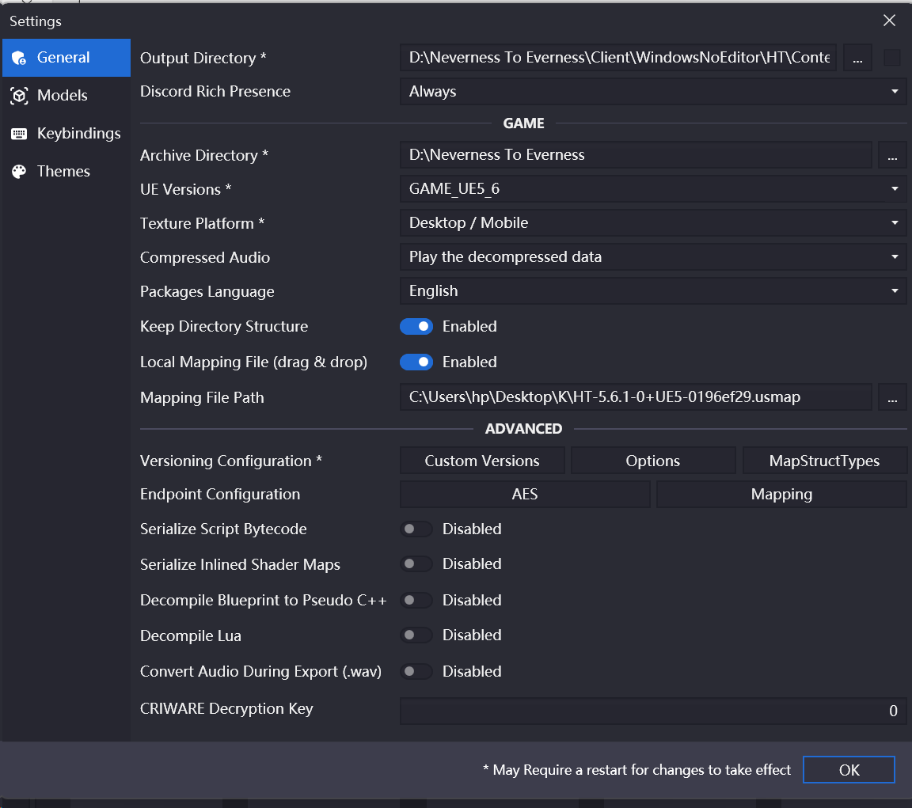
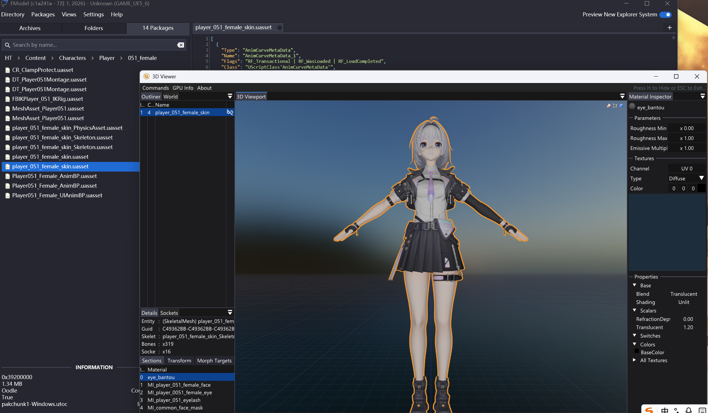

## 准备工作

### 游戏信息

引擎：在…\Neverness To Everness\Client\WindowsNoEditor\HT\Binaries\Win64 下，找到游戏的主程序 HTGame.exe，右键点击 **属性/详细信息**，查看产品版本中引擎为 UE 5.6.1

资源存储格式：**`.utoc`** 、**`.ucas`** 

- **`.utoc`** ：相当于目录
- **`.ucas`** ：相当于仓库

PAK 文件路径：…\Neverness To Everness\Client\WindowsNoEditor\HT\Content\Paks 和 PatchPaks

### 必备工具

**AES Key**：`0x370E80AA7DCA90A938A4D85013C5A16129AB3079902532B3325CA5B72B740FC7`

> 如果 Key 过时了，请在 [CSRINRU](https://cs.rin.ru/forum/viewtopic.php?f=10&t=100672) 获取最新 Key
>
> 如果 CSRINRU 也没有的话，尝试用 [AESDumpster](https://github.com/GHFear/AESDumpster) 获取（把游戏主程序拖到 AESDumpster.exe 上），或者等待社区提供

`.usmap` 映射文件：放在 [度盘](https://pan.baidu.com/s/1s2JxxE8QNELLDLAGr8bGSQ?pwd=KTEC) 自行获取

> 也可以用 [UE4SS-RE](https://github.com/UE4SS-RE/RE-UE4SS) 获取，参考 [小莫](https://wiki.aoe.top/ModTutorial/UE_Modding/0.TheBasics/Extractingusmap.html)
>
> 还可以在 [UMA](https://github.com/TheNaeem/Unreal-Mappings-Archive) 里找和你解包游戏引擎相同的映射文件来用

在虚幻 4 引擎用到的工具 [FModel](https://fmodel.app/) 同样能用，记得检查电脑的 `.NET` 版本

> FModel 详细步骤参考虚幻 4 引擎解包

## 解包过程

1. 打开 FModel.exe，点击左上角 **Directory**，然后选择 **Selector**，在 **ADD UNDETECTED GAME** 一栏选择要解包的路径，然后点击加号加入路径（图片用尘白禁区当参考了，知道步骤就行）

2. 选择 **AES** 填入 Key，解密成功后由红色变为绿色（输入密钥后需要重启一下）

   

3. 在 Settings/General 启用 **Local Mapping File**，并提供 `.usmap` 文件

   

4. 在 Archives 全选点击 **load** 上传，选择你需要的文件或文件夹，右键导出就行

   异环人物模型路径为…\HT\Content\Characters\Player，女主零的模型编号是 51，右键导出选择导出 **Models**

   

---

感谢@尚姐 提供的帮助
